<div align="center">



**A reference trading client for the QMS useful-work marketplace — post a portfolio problem, let PoUW solvers compete, verify the winner on-chain.**

[](https://testnet.qmsscan.io/address/0x3865C6d9A678b74E7bBDA6d3Ad862B864C7eb0b9)
[](https://testnet.qmsscan.io/tx/0x284ab204b16c7ad6f7b10c72a5497074b34bc9db7958d393b0112b464e661229)
[](https://qms.finance)
[](LICENSE)


</div>

> QMS v0.1 mines blocks by solving *randomly generated* QUBO instances. The client-facing half of the design — clients posting real problems, locking a fee, getting ranked solutions back — is scheduled for QMS v2. QuboDesk builds that half today, from the client's side, for the persona the QMS docs name explicitly: *a trading firm using QUBO for portfolio optimization that needs the solver wired to wallets and exchanges.*

## Live on QMS testnet

`QuboMarket` is deployed and source-verified at [`0x3865C6d9A678b74E7bBDA6d3Ad862B864C7eb0b9`](https://testnet.qmsscan.io/address/0x3865C6d9A678b74E7bBDA6d3Ad862B864C7eb0b9) (chain 19480, block 52068).

**Job 0** — a real portfolio: top-32 Hyperliquid perps by volume, 14 days of hourly funding, pick 8 basis legs. The client only pays for a solution **strictly better** than greedy top-8-by-carry.

| Step | Block | Tx | What happened |
|---|---|---|---|
| Post | — | [`0x759ae4960f06e857f6c57fbc0f43f3308ffddb7bbad028eb5a20cd9343752d57`](https://testnet.qmsscan.io/tx/0x759ae4960f06e857f6c57fbc0f43f3308ffddb7bbad028eb5a20cd9343752d57) | 528-term QUBO emitted on-chain, 0.5 QMS locked, bar E ≤ −4472568 |
| Commit | 52104 | [`0xeb9b51722bae6af0d8fb9f62f23627d091f18fbcf5943dc4b5194f720c5ef162`](https://testnet.qmsscan.io/tx/0xeb9b51722bae6af0d8fb9f62f23627d091f18fbcf5943dc4b5194f720c5ef162) | solver bot solved in 20 s (230k SA restarts), committed `keccak(job, solver, x, salt)` |
| Reveal | 52129 | [`0x0bbca45dc83c39fb887063023e1398115426a889c5b04f0056c3acda7de15e18`](https://testnet.qmsscan.io/tx/0x0bbca45dc83c39fb887063023e1398115426a889c5b04f0056c3acda7de15e18) | contract recomputed `xᵀQx` = **−4485505** for x = `0x83384040` (8 legs) |
| Settle | 52161 | [`0x284ab204b16c7ad6f7b10c72a5497074b34bc9db7958d393b0112b464e661229`](https://testnet.qmsscan.io/tx/0x284ab204b16c7ad6f7b10c72a5497074b34bc9db7958d393b0112b464e661229) | beat the bar by 12 938 → solver credited 0.5 QMS |
| Withdraw | — | [`0x159c1f1a5c3ed7473bef94d663892a47356ac65d4e0c8dba83c6f820df7cd50a`](https://testnet.qmsscan.io/tx/0x159c1f1a5c3ed7473bef94d663892a47356ac65d4e0c8dba83c6f820df7cd50a) | pull payment |

**The winning book**, decoded from the on-chain bitstring:

| | Legs (all short-perp) | Carry Σ | Risk | Carry/√risk |
|---|---|---|---|---|
| Greedy top-8 by carry | WLD ZRO PONS XPL MON NIL XMR FET | 211.4 % APR | 0.926 | 2.20 |
| **QuboDesk winner (on-chain)** | PUMP ZRO PONS XPL ONDO MON VVV FET | 187.3 % APR | **0.209** | **4.09** |

It gives up 11 % of headline carry to cut carry instability by 77 %. It does this by swapping WLD, NIL and XMR for PUMP, ONDO and VVV: legs with lower carry, but whose daily funding moves less in step with the rest of the book over the 14-day window. The market pays on the client's objective, E = −carry + λ·risk with λ = 1, not on the ratio. A 2-second local solve found a book with a higher ratio (4.55) but a worse E, so it would have lost this job. The client's λ defines "best", and the contract enforces it.

Reproduce it — `book` refuses to decode unless the job file's bytes hash to the instance posted on-chain:

```bash
python -m qubodesk book 0 examples/job-0.json
```

> First job: the client and the solver are the same burner wallet. It proves the full loop end to end; it isn't a demand signal.

## Why

The QMS flywheel only turns if paying clients show up. Miners are easy to imagine; a client actually posting a job is not, and nobody has shown one yet.

QuboDesk is that client, end to end:

1. **A real problem.** Pick *k* funding-rate basis legs out of *N* perps, maximising carry while penalising legs whose funding swings together. That is a cardinality-constrained mean-variance problem — a textbook QUBO.
2. **A trustless market.** The contract never trusts a solver's claimed score. It recomputes `E(x) = xᵀQx` on-chain from the instance's hash-committed bytes, so *verification is the consensus rule*, not an oracle.
3. **Back to the book.** The winning bitstring decodes into legs and sides, ready for an executor.

On the synthetic 32-coin demo, greedy top-8-by-carry gets **141% APR at risk 13.0 (carry/√risk 0.39)**; the market's winning solution gets **98% APR at risk 0.12 (carry/√risk 2.84)** — about 7× more carry per unit of carry instability.

## Architecture

```
  ┌──────────── client (trader) ────────────┐        ┌────────── solvers (useful-work miners) ──────────┐
  │                                         │        │                                                   │
  │  funding history ─► encoder.py          │        │  bot.py  ─ watch JobPosted logs                   │
  │  (HL / CSV / synthetic)   │ μ, Σ, k, λ  │        │     │                                             │
  │                           ▼             │        │     ▼                                             │
  │         QUBO (int32, upper-triangular)  │        │  qsa (Rust SA, multi-thread) ─► best x            │
  │                           │             │        │     │                                             │
  │   qubodesk post ──────────┼─────────────┼──┐  ┌──┼─ commit keccak(job, solver, x, salt)            │
  │   (fee locked, quality bar)             │  │  │  │  … commit window closes …                         │
  │                                         │  │  │  └─ reveal(x, salt, Q) ─────────────────┐          │
  └─────────────────────────────────────────┘  │  │                                           │          │
                                               ▼  ▼                                           ▼          │
                           ┌────────────────────── QuboMarket.sol · QMS testnet ──────────────────────┐ │
                           │ stores keccak(Q) only · emits Q in JobPosted (chain = data availability) │ │
                           │ reveal: hash(Q) ✓ · commitment ✓ · E(x) computed on-chain · best kept    │ │
                           │ settle: best ≤ quality bar → solver credited, else client refunded       │ │
                           └──────────────────────────────────────┬───────────────────────────────────┘ │
                                                                  ▼                                      │
                                       qubodesk book ─► book.json ─► exec.py (dry run / HL testnet perps)
```

## Tech stack

| Layer | Choice | Why |
|---|---|---|
| Market | `QuboMarket.sol`, Solidity 0.8.30, via-IR | On-chain `xᵀQx` in assembly over calldata; pull payments |
| Wire format | 6-byte entries `[i:u8][j:u8][w:i32]`, ≤256 vars, ≤8192 terms | Cheap calldata, exact integer energy |
| Encoder | Python + numpy | Funding streams → μ, Σ → QUBO with provably sufficient penalty |
| Solver | `qsa`, Rust, zero dependencies | SA + 1-flip polish, all cores, time-budgeted |
| Bot | web3.py, JSON state file, PM2 | Salt persisted *before* commit; survives restarts |
| Tests | Foundry (19, incl. 1000-run fuzz) · pytest (15) · anvil e2e (normal + tie race) | Contract energy == Python energy == solver energy |

## Flow

1. `qubodesk encode` builds the instance and a **greedy baseline** (top-k by carry).
2. `qubodesk post --accept beat-baseline` locks the fee and sets the quality bar to *strictly better than greedy* — the client only pays for improvement.
3. Solver bots read `Q` straight from the `JobPosted` log, solve for half the remaining commit window, and commit `keccak256(jobId, solver, x, salt)`.
4. After `commitEnd`, each bot checks the current on-chain best and reveals only if it would win under the contract's rule (lower energy, then earlier commit block), so hopeless reveals don't burn gas.
5. After `revealEnd`, anyone calls `settle`. The winner is credited if `bestEnergy ≤ acceptEnergy`, otherwise the client is refunded. `withdraw` pulls funds.
6. `qubodesk book` checks the local job file against the on-chain instance bytes and decodes the winning legs; `exec.py` turns them into orders.

## Smart contract

The whole trust model is this loop — the instance is hash-checked, then evaluated from calldata:

```solidity
function reveal(uint256 jobId, uint256 x, bytes32 salt, bytes calldata q) external returns (int256 e) {
    ...
    if (c != commitmentFor(jobId, msg.sender, x, salt)) revert CommitmentMismatch();
    if (keccak256(q) != job.qHash) revert InstanceMismatch();
    if (n < 256 && (x >> n) != 0) revert SolutionOutOfRange();
    e = energy(q, x);                        // xᵀQx, on-chain
    bool isBest = e < job.bestEnergy         // lower energy wins
        || (e == job.bestEnergy && c.blockNumber < job.bestCommitBlock);   // tie → first to COMMIT
    ...
}

function energy(bytes calldata q, uint256 x) public pure returns (int256 e) {
    uint256 entries = q.length / 6;
    assembly ("memory-safe") {
        let end := add(q.offset, mul(entries, 6))
        for { let p := q.offset } lt(p, end) { p := add(p, 6) } {
            let word := calldataload(p)
            if and(and(shr(byte(0, word), x), shr(byte(1, word), x)), 1) {
                e := add(e, signextend(3, shr(224, shl(16, word))))   // int32 weight
            }
        }
    }
}
```

| Guard | Covered by |
|---|---|
| Copying someone's commitment from the mempool is useless — the solver address is inside the hash | `test_copiedCommitmentIsUseless` |
| A forged, easier instance can't be revealed against | `test_wrongInstanceRejected` |
| Bits above `n` rejected; one reveal per commitment; one settlement per job | `test_outOfRangeBitsRejected`, `test_doubleRevealAndDoubleSettleBlocked` |
| Below the client's bar → refund, never a payout | `test_acceptEnergyRefundsClient` |
| Equal energy → earliest **commit** wins, even if it reveals last (the reveal race is RPC latency, not merit) | `test_tieGoesToEarlierCommit_evenIfRevealedLater`, e2e `TIE=1` |
| Re-committing resets your commit block — a placeholder commit can't reserve tie priority | `test_recommitResetsPriority` |
| Assembly energy == naive reference on random instances up to n=256 | `testFuzz_energyMatchesReference` (1000 runs) |

**Gas:** job 0's reveal (n=32, 528 terms) is in the table above; a dense n=64 instance (2,080 terms, 12.5 KB) costs ~267k gas of execution to reveal, plus calldata.

**QMS v0.1 specifics handled:** windows are in **blocks** (PoUW block times are probabilistic, 10 s target); nothing uses `PREVRANDAO` (it returns 0); the bot acts on **confirmation depth** because `finalized` returns genesis until the finality layer ships.

## Encoder math

With x_i = 1 meaning "hold the basis leg on coin i":

```
E(x) = −Σ μᵢxᵢ + λ·xᵀΣx + A(Σxᵢ − k)²
     → Q_ii = −μᵢ + λΣᵢᵢ + A(1 − 2k),   Q_ij = 2λΣᵢⱼ + 2A  (i<j)
```

μ is the mean annualised carry (direction = sign of mean funding), Σ the covariance of **daily-averaged** carry, so risk means "how much the carry regime swings and how legs swing together". `A = 1.5 × max single-flip objective gain`, which makes **every 1-flip local minimum feasible** — checked exhaustively in `test_every_one_flip_local_min_is_feasible`.

## Local dev

```bash
# prerequisites: Foundry, Rust, Python 3.11+
pip install -r requirements.txt
cargo build --release --manifest-path solver/Cargo.toml

forge test -vv                      # contract
python -m pytest -q tests           # encoder / solver / wire format
./scripts/demo_local.sh             # anvil: deploy → post → 2 competing bots → settle → book
TIE=1 ./scripts/demo_local.sh       # both bots hit the optimum; the later committer reveals first and still loses
```

Offline only:

```bash
python -m qubodesk encode --source synthetic --n 20 --k 5 --out job.json
python -m qubodesk solve job.json --exact            # brute-force check for n ≤ 22
python -m qubodesk encode --source hl --n 32 --k 8 --days 14 --out job.json   # live Hyperliquid funding
```

## Deployment (QMS testnet)

```bash
python3 -m venv .venv && source .venv/bin/activate && pip install -r requirements.txt
cp .env.example .env                 # or just PRIVATE_KEY=… (burner); fund it at faucet.testnet.qms.finance
./scripts/deploy_qms.sh              # deploys, writes MARKET_ADDRESS + MARKET_DEPLOY_BLOCK, verifies on Blockscout
                                     # refuses to overwrite a live MARKET_ADDRESS unless --force

# client
python -m qubodesk encode --source hl --n 32 --k 8 --out job.json
python -m qubodesk post job.json --fee 0.5 --commit-blocks 30 --reveal-blocks 30 --accept beat-baseline
python -m qubodesk jobs

# solver (PM2)
pm2 start ecosystem.config.js && pm2 save

# after revealEnd
python -m qubodesk book 0 job.json && python -m qubodesk.exec book.json            # dry run
```

### Independent solver wallets

A client paying itself proves the plumbing, not the market. Create burner solver wallets funded from the main `.env` wallet. Each key goes to its own `.env.<name>` file (mode 600, gitignored) and is never printed:

```bash
python -m qubodesk.wallets new solver1 --fund 3
python -m qubodesk.wallets new solver2 --fund 3
python -m qubodesk.wallets list                     # addresses + balances, flags duplicate keys

pm2 stop qubodesk-solver                            # the client must not solve its own job
pm2 start ecosystem.config.js --only qubodesk-solver-1,qubodesk-solver-2 && pm2 save
```

`--env-file` overrides `PRIVATE_KEY` even if one is exported in the shell, so a solver can never run with the client's key by accident. The two PM2 solvers get different compute budgets (25 s vs 6 s) and really compete.

`exec.py --hl-testnet` places the **perp legs only** on Hyperliquid testnet (needs `hyperliquid-python-sdk`). On its own a perp leg is directional — it's a plumbing demo, and mainnet is deliberately unsupported.

### Benchmark against the chain's own miners

Every QMS block page links the QUBO instance that was mined (`.mtx.gz`) and the winning solution. The objective convention isn't published yet, so `bench` supports both readings — the one that reproduces the explorer's number is the right one:

```bash
python -m qubodesk bench block-123.mtx.gz --convention full  --block-x 0x… --block-energy -1234.5
python -m qubodesk bench block-123.mtx.gz --convention upper --block-x 0x… --block-energy -1234.5
```

## Scope and roadmap

- **Today:** client-side reference market on QMS testnet, settled in native QMS. Solvers run *outside* consensus.
- **When QMS v2 ships its marketplace:** keep the encoder, bot and executor; swap `QuboMarket` for the canonical contract. Happy to align with an interface spec.
- **Not done here:** a hedged executor (spot/other-venue leg), problem classes beyond QUBO, partial payouts across ranked solutions.

## Attribution

QMS Network design (PoUW, QUBO, marketplace, finality) per the [QMS docs](https://docs.qms.finance) and white paper. Temperature schedule in `qsa` follows the common heuristic used by D-Wave's `neal`. Built by [@Makabeez](https://github.com/Makabeez).

## License

MIT
